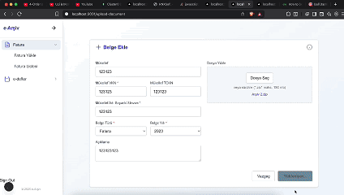

# 📦 Invoice App

A full-stack application for uploading, categorizing, and viewing multiple invoices. Built with Next.js, BullMQ, Redis, Prisma, and MongoDB Atlas. Background processing is handled via BullMQ and Redis, and invoice data is stored and queried efficiently.

---

## 

---

## 🚀 Features

- **Bulk Invoice Upload:** Upload multiple invoices at once (as ZIP files containing XML invoices).
- **Background Processing:** Invoice files are processed in the background using BullMQ workers and Redis.
- **Categorization:** Invoices are categorized by type, year, and associated taxpayer (mükellef).
- **Filtering & Search:** Easily filter and search invoices by number, supplier, customer, type, and more.
- **Invoice Viewing:** View invoice details and download as PDF.
- **Admin Dashboard:** Monitor background jobs and queues via Bull Board.
- **Authentication:** User registration and login.

---

## 🛠️ Getting Started

### 1. Clone the repository

```bash
git clone https://github.com/firatk/your-repo-name.git
cd your-repo-name
```

### 2. Install dependencies

```bash
npm install
```

### 3. Configure Environment Variables

Create a `.env` file in the root directory and set the following variables:

```
DATABASE_URL=your_mongodb_atlas_url
REDIS_URL=your_redis_url
NEXTAUTH_SECRET=your_secret
```

### 4. Run Database Migrations (if needed)

```bash
npx prisma generate
```

---

## 🏃 Running the App

You need to run three things in parallel:

### 1. Start the Next.js App

```bash
npm run dev
```

### 2. Start the Workers

In separate terminals, run:

```bash
node workers/documentWorker.js
node workers/invoiceWorker.js
```

### 3. Start Bull Board (Admin Dashboard)

```bash
node bull-board.js
```

Bull Board will be available at [http://localhost:3001/admin/queues](http://localhost:3001/admin/queues)

---

## 📂 How It Works

1. **Upload:** Users upload a ZIP file containing multiple XML invoices.
2. **Processing:** The ZIP is extracted, and each XML invoice is processed in the background by workers. Invoice data is extracted and saved to the database.
3. **Categorization:** Invoices are categorized by type, year, and taxpayer.
4. **Viewing:** Users can view, filter, and search invoices. Each invoice can be viewed in detail and downloaded as PDF.
5. **Monitoring:** Admins can monitor the status of background jobs and queues via Bull Board.

---

## 📁 Project Structure

- `app/` - Next.js app directory (pages, components, layouts)
- `pages/api/` - API routes for authentication, document, and invoice operations
- `workers/` - BullMQ workers for background processing
- `lib/queues/` - BullMQ queue definitions
- `lib/redis/` - Redis connection
- `functions/util/` - Utility functions for parsing and processing invoices
- `prisma/` - Prisma schema and client
- `uploads/` - Uploaded and processed invoice files

---

## 🧑‍💻 Tech Stack

- **Frontend:** Next.js, React, Tailwind CSS
- **Backend:** Next.js API routes, BullMQ, Express (for Bull Board)
- **Database:** MongoDB Atlas (via Prisma)
- **Queue:** BullMQ + Redis
- **Authentication:** NextAuth.js

---

## 📊 Monitoring

- **Bull Board:** [http://localhost:3001/admin/queues](http://localhost:3001/admin/queues) — Monitor background jobs and queues.

---

## 📄 License

MIT
